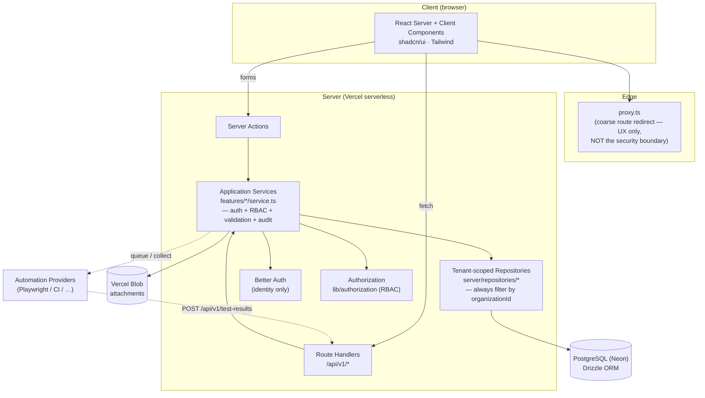
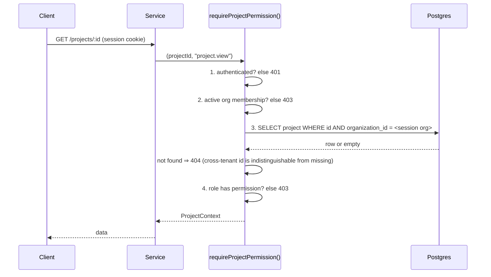
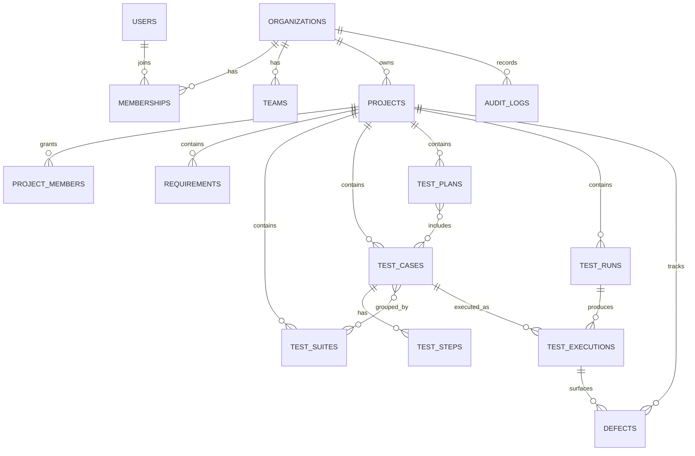
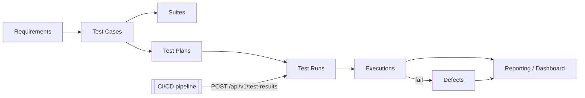

# High-Level Design — QA Management Platform

A scalable, cloud-based, **multi-tenant** Quality Assurance management platform:
multiple organizations and teams collaborate in one application across the full
QA lifecycle — manual testing, automation, execution, defects, reporting — with
role-based access control and complete data isolation.

- **Live demo:** https://qamanagement-one.vercel.app
- **Repository:** https://github.com/jaiminpanchal2002/QA_MANAGEMENT_PLATFORM
- **Demo login (org "Acme QA"):** `owner@acme.test` / `Password123!`
  (a second org, "Globex Testing", exists to prove tenant isolation)

> This document is the high-level design. For full depth (route list, complete
> RBAC matrix, ERD, security strategy) see [ARCHITECTURE.md](./ARCHITECTURE.md);
> for scope honesty see [STATUS.md](./STATUS.md).

---

## 1. Goals & non-goals

**Goals**
- Multiple organizations (tenants), each with many users, teams, projects.
- Complete tenant data isolation, enforced server-side (no cross-tenant access).
- Centralized, server-enforced RBAC (org-level + project-level roles).
- Full QA lifecycle: requirements → test cases → suites → plans → runs →
  executions → defects → reporting.
- Automation as an integration layer (async), plus CI/CD result ingestion.
- Production-grade concerns: validation, error handling, audit, security,
  testing, deployment readiness.

**Non-goals (deliberate simplifications)**
- Not microservices — a **modular monolith** (one deployable) with clean module
  seams that can be extracted later. Avoids premature operational complexity.
- Not running heavyweight test frameworks inside the web tier — automation is
  delegated to external providers via an adapter interface.

---

## 2. Architecture — Modular Monolith

One Next.js deployable, organized by domain module. Dependencies point downward;
each layer has a single responsibility, which is what makes future extraction
into services cheap.

- **Services** establish the trusted context (who, which tenant, what role) and
  orchestrate validation → repository → audit. They never accept a client-supplied
  `organizationId`.
- **Repositories** are pure, tenant-scoped data access — every function takes and
  filters by `organizationId`.

---

## 3. Multi-tenancy & IDOR prevention

Every tenant-owned row carries `organization_id`. The active tenant is derived
from the session (validated against real memberships), never trusted from the
client. Project-scoped access runs through one guard that fails closed:

A valid ID from another tenant returns **404**, not the data and not a 403 that
would leak existence. Proven by automated isolation tests and verified live over
HTTP.

---

## 4. RBAC

Two role dimensions, resolved by a centralized, pure permission function
(`lib/authorization`). Org Owner/Admin implicitly hold all project permissions
in their tenant; other users need an explicit project role.

| Dimension | Roles |
| --- | --- |
| Organization | OWNER · ADMIN · MEMBER · VIEWER |
| Project | PROJECT_ADMIN · QA_LEAD · QA_ENGINEER · DEVELOPER · VIEWER |

Privilege-escalation guard: a user can only assign roles at or below their own;
only OWNER can grant OWNER. Full matrix in [ARCHITECTURE.md](./ARCHITECTURE.md).

---

## 5. Data model (core entities)

Conventions: UUID PKs, `created_at`/`updated_at` everywhere, soft delete where
recoverability matters, tenant-scoped uniqueness (project `key` unique per org,
test-case `reference` unique per project), and indexes on `organization_id`,
`project_id`, `status`, `severity`, `created_at` and every FK.

---

## 6. QA lifecycle

Dashboard metrics (pass rate, execution trend, defects by severity, automation
coverage) are computed by **server-side SQL aggregation** — no hardcoded numbers.

---

## 7. Automation & CI/CD integration

Automation is an **asynchronous integration layer**, not in-process execution.

- `AutomationProvider` interface: `createRun / startRun / getRunStatus /
  cancelRun / collectResults`. A `SimulatedProvider` ships for the demo; a real
  provider (GitHub Actions dispatcher, etc.) implements the same interface and is
  swapped in via a registry — no call-site changes.
- External pipelines submit results to `POST /api/v1/test-results`, authenticated
  by a hashed bearer token (only a SHA-256 hash + prefix stored; constant-time
  compare), with a Zod-validated payload. Results are matched to existing test
  cases by reference — never trusted blindly. Parsers (e.g. JUnit XML) normalize
  different formats into one internal model.

---

## 8. Security

Server-enforced auth + RBAC on every action/handler/read (the proxy is a UX
redirect only). Better Auth (hashed passwords, secure http-only sessions,
verification/reset). Zod validation at every boundary. Consistent error taxonomy
that never leaks stack traces/SQL to clients while logging full detail
server-side (with sensitive-key redaction). Rate limiting, security headers
(CSP, HSTS, X-Frame-Options, …), attachment access authorized per request
(Blob stores the bytes, DB stores metadata only), and an **immutable audit log**.

---

## 9. Technology choices & rationale

| Area | Choice | Why |
| --- | --- | --- |
| Framework | Next.js (App Router) + TypeScript (strict) | One codebase for UI + API; RSC minimizes client JS; Route Handlers give a clean REST surface; great DX + Vercel fit. |
| Database | PostgreSQL (Neon) | The QA domain is highly relational (traceability, FKs, constraints); Neon is serverless-friendly with branching for previews. |
| ORM | Drizzle | Typed, parameterized SQL (injection-safe), first-class migrations, thin runtime, easy to scope every query by tenant. |
| Auth | Better Auth | Modern, self-hostable; kept to *identity only* so the RBAC layer stays fully under our control. |
| Authorization | Custom, centralized RBAC | Single source of truth; exhaustively unit-tested; no scattered checks. |
| UI | Tailwind + shadcn/ui (Radix) + Geist | Accessible, consistent, enterprise-grade UI with no vendor lock-in. |
| Validation | Zod (+ React Hook Form) | One schema reused across API, server actions and forms. |
| Files / Email | Vercel Blob / Resend (abstracted) | Managed storage; provider-swappable email with a dev console fallback. |
| Testing | Vitest + Playwright | Unit + integration (incl. tenant-isolation & RBAC) + E2E. |
| Deploy | Vercel | Zero-config, preview environments, edge network. |

---

## 10. Scalability & how to proceed to production

- **Read scaling:** Neon read replicas; the repository layer is the single place
  to route reads.
- **Async work:** automation is already modeled async (external job ids) — move
  queueing to a durable queue (QStash/SQS) + worker without touching call sites.
- **Caching:** request-level and tag-based (`revalidateTag`) caching for heavy
  dashboard aggregations; precompute rollups for very large tenants.
- **Partitioning:** partition `audit_logs` / `test_executions` by time or tenant
  as volume grows (indexes are already tenant-first).
- **Defense-in-depth:** optional Postgres Row-Level Security keyed on a session
  GUC, backing the application-level tenant scoping.
- **Service extraction:** lift a module (automation, reporting) out behind its
  existing service interface when a team/scale boundary justifies it.
- **Remaining product surface:** finish CRUD screens for test plans, teams and
  invitations (schema + permissions already modeled — see STATUS.md).

---

## 11. Quality gates

`pnpm verify` runs the full gate; the build fails if any step fails:

- TypeScript (strict) · ESLint · Vitest (unit + integration + tenant-isolation) ·
  production build. A GitHub Actions workflow runs the same on every push/PR.
